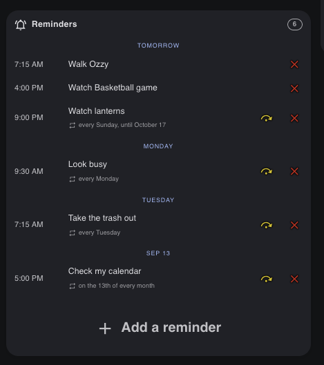
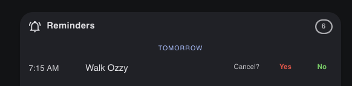

# Fiendishly Good Reminders

Provides the reminder functionality that Home Assistant has long needed.  Reminders are announced at the exact time scheduled **to the second**. This integration keeps its own store, calculates the timing internally in Python, and is completely LLM independent.

> "Remind me to take the bins out every Sunday at 9 pm for the next 6 weeks."

The integration provides six reminder actions, two reminder entities and a custom reminder
dashboard card. Also included below is a suggested set of voice sentences that can be used to
schedule, cancel, skip or list your reminders. The actions may equally be called
programmatically.

| Action | What it does |
|---|---|
| **`schedule`** | Creates a reminder — one-off or repeating, with an optional end after a number of weeks, a number of times, or a named date |
| **`cancel`** | Removes a reminder outright. For a repeating one that is **every** occurrence, which is why it reads the match back and waits for a yes |
| **`skip`** | Drops the next occurrence, or everything up to Saturday, and leaves the series running. Asks first only when the skip would exhaust the rule and delete the reminder |
| **`list`** | The upcoming reminders, soonest first, over however many days you ask for |
| **`find`** | Searches by text, by a named day, or by a period — one entry per reminder however often it repeats, with the occurrences that fall inside the range |
| **`edit`** | Changes a reminder's wording, its time, or its recurrence. Moving a series re-anchors the whole pattern; changing the pattern leaves the hour alone |

Every one of them **answers**: a `success` code and, when it is not `1`, an `error` saying
exactly what went wrong. Nothing raises, so a script always gets to read what happened.

Add single or recurring reminders — recurring daily, weekly, or monthly. Say "Remind me again in [time]" to reset the last reminder. Edit existing reminders. Pretty much anything you want. All local, no LLM interference.

**A list each, for everyone in the house.** Add the integration once per person and each gets
their own reminders, kept entirely separate — nothing is shared between two lists but the
grammar. Each list is given its own speakers and its own phones, and they may overlap however
suits the house: John's reminders speak in the study and the kitchen, Jen's in the bedroom and
the kitchen, and the kitchen carries both. A reminder finds the right list from a name in the
sentence — *"remind Jen to water the plants"* — or from the speaker you said it to, and where
a shared speaker leaves it genuinely ambiguous it asks rather than guesses. See
[One list per person](#one-list-per-person).

---

## Why this exists

Home Assistant still has no native reminder. As of 2026.9 the built-in to-do intent (`HassListAddItem`) accepts no due date at all, and the PR to add one was closed. Prior reminder integrations and blueprints used a simple to-do list and a polling loop, but *a to-do item cannot trigger an automation*. That required a compromise: a reminder due at 9:00 arrives at the next poll, somewhere between 30 seconds and 15 minutes later. Others handed the sentence to an LLM to parse, which is where a request becomes a confident reply and no reminder at all.

In contrast to the above, this integration owns its own schedule, so neither compromise is necessary:

- **Reminders fire at the second.**
- **No LLM anywhere in the path.** Python does the arithmetic, and every action answers with a response variable saying either that the reminder was scheduled or exactly why it was not — so you get accurate feedback on your requests.
- **Reminders persist**, and one that came due while Home Assistant was down is delivered on restart rather than lost.

## What it does

| | |
|---|---|
| **Exact firing** | To the second, from a persistent store that survives restarts |
| **Say it in two breaths** | Name the task with no time and it asks **"When should this reminder occur?"** |
| **Late delivery** | Anything overdue by less than an hour at startup is still delivered |
| **Recurrence** | Daily, weekly, weekdays, weekends, monthly — and series that **end** |
| **Skip one** | Drop a single occurrence, or a whole week, leaving the series running |
| **Cancel** | By text, by time, or by id — and it **reads the match back and waits for a yes** |
| **Presence & quiet-hours routing** | Speaks in the room when you are home and awake, pushes to your phone otherwise |
| **Degrading delivery** | Satellites → notify service → persistent notification. Never throws |
| **Says whose it is** | With two lists, a reminder arrives as *"Reminder for John: take the trash out"* |
| **Turned round to face you** | You say *"remind me to take my pills"*; it says *"take **your** pills"* |
| **Entities** | A to-do list and a timestamp sensor carrying the whole list in attributes |
| **Dashboard card** | A companion card that shows recurrence, which the to-do card cannot |
| **One list per person** | Add it once for each of you: separate lists, separate speakers, separate phones |

---

## Requirements

- Home Assistant **2026.8** or newer (developed and tested on 2026.8.3)
- **A way to deliver a reminder — at least one of:** an `assist_satellite` entity (Voice PE hardware works; so does anything else exposing that domain), **or** one or more `notify` entities or services, such as the companion app
- For the spoken cancel confirmation and the two-turn edit: a satellite supporting `START_CONVERSATION` (supported-features bit 2). Home Assistant Voice PE has it; the built-in microphone on a Yellow/Green does not

- No Python dependencies beyond what ships with Home Assistant.

---

## Installation

The integration itself is the component. It exposes six actions and two entities, and that is all you need — automations, scripts, dashboards and your own voice sentences can drive it from there.

A **suggested** sentence file is included for people who want the voice commands described below without writing any. It is genuinely optional: skip it and everything except the supplied phrasings still works. 

### Via HACS (custom repository)

1. HACS → **Integrations** → ⋮ → **Custom repositories**
2. Paste `https://github.com/fiendishly-delicious/fiendishly-good-reminders`, category
   **Integration**
3. Search HACS for **Fiendishly Good Reminders** and download it
4. *(Optional)* For the supplied voice commands, copy `custom_sentences/en/reminders.yaml`
   from the repository into `/config/custom_sentences/en/reminders.yaml`, creating the
   folders if needed. Skip this if you would rather write your own
5. **Restart Home Assistant.** A custom integration is not picked up by a reload —
   `automation.reload` and friends will not see the new services
6. Settings → Devices & Services → **Add Integration** → *Fiendishly Good Reminders*

### Manually

1. Copy the `fiendishly_reminders` folder into `/config/custom_components/` so you have
   `/config/custom_components/fiendishly_reminders/__init__.py`
2. *(Optional)* For the supplied voice commands, copy `custom_sentences/en/reminders.yaml`
   into `/config/custom_sentences/en/`
3. Add one line to `configuration.yaml`:

   ```yaml
   fiendishly_reminders:
   ```

   This key holds no configuration — everything is set up in the UI. It exists so the
   component is set up during **bootstrap**, which registers the voice intents before the
   config entry finishes loading. Without it, a reminder spoken during the first minute or
   two after a restart answers *"Unknown intent"* while the entry waits behind slower
   integrations. Harmless, and worth adding, even if you use none of the supplied
   sentences.
4. **Restart Home Assistant**
5. Settings → Devices & Services → **Add Integration** → *Fiendishly Good Reminders*

---

## Configuration

All configuration is through the UI. The same form is available afterwards under **Configure**, and changing it reloads the integration without a restart.

The form is in six sections. Every field is optional except the name and one delivery
channel, and submitting without them comes back naming what is missing rather than saving
a half-set-up list.

| Section | Field | Required | What it does | Default |
|---|---|---|---|---|
| **Whose Reminders** | Whose reminders are these? | **Yes** | The list's name. It titles the entry — *John* gives *John's Reminders* — and it is how a spoken reminder finds the right list when there is more than one | *(none)* |
| **Send Reminders to:** | Target Satellites | **One of these two** | `assist_satellite` entities that speak reminders. Also the only satellites a spoken question is ever asked on | *(none)* |
| | Notification Recipient(s) | **One of these two** | Where a reminder goes when it cannot or should not be spoken aloud. Pick as many as you like | *(none)* |
| **Prevent Spoken Reminders If:** | This person is not home | No | A `person` entity. While it is not `home`, reminders go to the notification recipients instead of being spoken | *(none)* |
| | Quiet Hours Start | No | Beginning of the do-not-disturb window. **Clear it with the X to switch quiet hours off** | *(none)* |
| | Quiet Hours End | No | End of it. The window wraps midnight | *(none)* |
| **Chimes** | Play Chime Before Reminder | **Yes** | Whether anything sounds before a spoken reminder at all | `Yes` |
| | Chime | No | Which sound: **fgReminders** (the bundled one), **Home Assistant's own chime**, or any file in `<config>/media/Chimes` | `fgReminders` |
| **Default Times** | Default Time | **Yes** | Used when a reminder names no time at all — "remind me to stretch every day", "remind me to call on Friday" | `08:15:00` |
| | Default Morning Time | **Yes** | What *tomorrow morning* and *Monday morning* resolve to | `08:15:00` |
| | Default Afternoon Time | **Yes** | What *this afternoon* resolves to | `14:00:00` |
| | Default Evening Time | **Yes** | Covers both *evening* and *night* — they are the same end of the day | `21:00:00` |
| **Confirmations** | Confirm before canceling | No | Read a cancellation back and wait for a yes. The help text under it warns that turning it off also **narrows what will be matched** — see below | `Yes` |

The four times are marked required only so that Home Assistant does not draw a clear button
beside them: they arrive filled in, and there is no such thing as "no morning". The two
delivery fields are the opposite — neither is required on its own, and the pair is checked by
hand, because "one or the other" is a condition across two fields rather than a property of
either.

Submitting with the name blank, or with no delivery target, comes back naming what is missing
and holding everything else you had already filled in.

**Give at least one delivery channel** — satellites, a notify service, or both. Either will do; what a setup cannot be is deaf and mute at once, because a reminder that fires exactly on time and has nowhere to go has achieved nothing. Every other field can only *remove* behavior by being absent:

- **No presence entity** → reminders are always considered speakable, so the satellites always get them.
- **No quiet hours** → there are no quiet hours. Clearing a field with its **X** is how you turn them off, and setting only one of the two is the same as setting neither.
- **Play Chime Before Reminder off** → the announcement plays with no sound in front of it at all. Silence is asked for explicitly rather than left unset, because `assist_satellite` plays its *own* sound when preannounce is not specified — which is what the **Home Assistant's own chime** option gives you instead.
- **No notification recipients** (satellites only) → there is no phone fallback. When a reminder should not be spoken — because you are not home, or it falls inside quiet hours — it is raised as a persistent notification instead, so it is still waiting for you rather than silently dropped.
- **No satellites** (recipients only) → everything goes to the notification recipients, and nothing is ever spoken aloud. Presence and quiet hours then make no difference to where a reminder lands, and the spoken confirmations described below do not apply: canceling happens immediately and says so, and `edit my … reminder` asks you to say the change in one sentence instead.
- **Confirm before canceling off** → a cancellation happens the moment you ask for it. It also **narrows what will be matched**: the tolerant matching that lets "cancel my dennist reminder" find *dentist* is only safe because the guess is named out loud before anything happens to it, so with nothing reading it back only an exact match is acted on. The guess and the question stand or fall together.
- **A time left at its default** → 08:15 for the plain one, and each part of the day keeps the hour it shipped with. The four cannot be blanked from the form; they are pre-filled and required.

**Your own chimes go in `<config>/media/Chimes`.** The integration creates that folder on
startup and serves it, so anything you drop in — `.mp3`, `.wav`, `.ogg`, `.flac`, `.m4a` —
appears in the picker named by its filename. It is *not* the media library: Home Assistant's
`/media` is a separate mount and `media_source` cannot see inside the config directory, so
this folder is served by the integration itself. Select a sound and later delete the file
and the picker falls back to the bundled one rather than refusing to open.

A part of the day only fills in a time nobody gave. *"Monday night"* is whatever **Default Evening Time**
is set to, but *"Monday night at 9"* is 9pm whatever it is set to — naming an hour always
wins, and the part of the day then only decides that 9 means the evening one.

The name is the one field with no sensible absence: a list has to be called something for a reminder to be addressed to it. On a single-list setup nothing ever needs to name it, but it costs one word now and saves reconfiguring later.

---

## One list per person

Add the integration a second time and you get a second, wholly separate list — its own
stored reminders, its own entities, its own satellites, its own phone. Nothing is shared
between two lists but the grammar.

### Setting up a second person

1. Settings → Devices & Services → **Add Integration** → *Fiendishly Good Reminders* again
2. Name it — *Jen*
3. Give it **her** notification recipients, and her presence entity and quiet hours
4. Give it **her** satellites — a speaker only one list owns needs no name spoken to it

If you are using the supplied sentences, add her to the `person` list at the foot of
`custom_sentences/en/reminders.yaml` and restart:

```yaml
lists:
  person:
    values:
      - in: "(john|johns|john's)"
        out: "John"
      - in: "(jen|jens|jen's|jennifer)"
        out: "Jen"
```

`out` has to match the list's name exactly; `in` is every way the speech-to-text might hand
it over, which is where the possessives and the long form of a name belong.

### How a spoken reminder finds the right list

In order, stopping at the first that settles it:

| | |
|---|---|
| **1. A name in the sentence** | *"Remind **Jen** to water the plants at four"* — works from any speaker in the house |
| **2. The satellite that heard it** | With no name, the list that owns that satellite. Say *"remind me to …"* to the speaker in Jen's study and it lands on Jen's list |
| **3. Ask** | On a satellite that two lists both claim — the kitchen — it asks **"Who's this reminder for?"**, or **"Whose reminders?"** for a question, and takes the name you answer with. It asks again if nothing comes back |
| **4. Nothing** | Nothing settled it and there was no satellite to ask on, so it says *"Whose list do you mean — John or Jen?"* and does nothing else |

The supplied sentences take a name on the questions too — *"how many reminders does Jen
have"*, *"what are Jen's reminders"*, *"when is Jen's dentist reminder"* — and on cancel and
skip: *"cancel Jen's dentist reminder"*. A name that matches no list is refused rather than
answered about somebody else.

Editing takes one too — *"edit Jen's lanterns reminder"*, *"move Jen's dentist reminder to
4 pm"* — so there is no action that cannot be reached by name.

The name goes in the ordinary opening of a sentence, not a separate phrasing, so **every**
time form, recurrence and bound documented here accepts one for free: *"remind Jen to take
the bins out every Sunday at 9 pm for the next 6 weeks"* needs nothing extra. With one list
set up the whole ladder is skipped, and *"remind Jen"* still works — it just has only one
place to go.

Note what is **not** used: the logged-in user. A spoken request carries no user at all — a
wake-word pipeline run has no session behind it — so routing on a username would work from
a browser and fail silently from every speaker in the house.

**The question has no time limit.** Silence is not an answer, so an unanswered attempt is
asked again rather than read as consent to file a reminder on someone else's list — a slow
answer is never punished by a clock. What ends it is a count of spoken attempts, three, and
the repeats name the options aloud: *"Sorry — who's this reminder for? John or Jen?"*.

**Both questions can happen in one exchange.** A reminder that gave neither a name nor a
time — *"remind me to water the ferns"* on a shared speaker — is asked whose first, then
when. That order is not arbitrary: the default hour the second question offers is the
chosen list's, so it cannot be asked until the first is settled.

**Questions ask too.** *"How many reminders do I have"* from a speaker two lists share has
two right answers, so it asks rather than picking one — and every answer names whose list it
came from as soon as a second list exists (*"Jen currently has 2 reminders"*), which matters
most when the list was chosen for you rather than named by you.

**And then it gives up out loud.** After the third unanswered attempt nothing is created,
and it says so. **There is no default list**: with two people set up there is no safe guess
about whose reminder this is, and one on the wrong person's list is worse than one not made
— it will be delivered, to the wrong person, and the person who asked for it will not find
out until it does not arrive.

An answer that matches no name is not treated as one either. If what you said names exactly
one list it is taken — *"that's Jennifer's"* finds Jen — and if it names none or both, the
question is simply asked again, because guessing between two people is the one outcome worse
than asking twice.

### Everything else

- **Entities carry the name.** A second list gets `todo.jen_reminders` and
  `sensor.jen_reminders_next_reminder`, on a **Jen Reminders** device. The first list keeps
  the plain `todo.reminders` it was created with — entity ids are fixed when an entity is
  first created, so naming an existing list does not rename its entities.
- **Every action takes a `target`** — the list's name, case-insensitive, `Jen` or `Jen's`
  alike. It is **required** once a second list exists: a call without one answers
  `success: 24`, and one naming a list that does not exist answers `23`. With a single
  list it can be left out.
- **One card each**, pointed at that person's sensor:
  `entity: sensor.jen_reminders_next_reminder`.
- **A delivered reminder is turned round to face you.** You say *"remind me to take my
  pills"* and it stores exactly that, but what it reads out is *"take **your** pills"* — first
  person becomes second, because the house is saying it back to you. Only at delivery: the
  store, the to-do list, the card and every text match keep the words you used, so *"cancel my
  take my pills reminder"* still finds it.
- **A delivered reminder names the list.** With more than one, it arrives as *"Reminder for
  John: take the trash out"* — spoken and on the phone, where it becomes the notification's
  title. With a single list it stays a plain *"Reminder:"*, since there is nobody else it
  could be for and nothing anyone already lives with should start announcing itself
  differently.
- **Removing a list deletes its stored reminders with it.** The other lists are untouched.


## Reminder voice flows

Every action can be driven by voice, and every one of them **answers**. When the sentence
carried everything needed, the answer is a confirmation that reads back what was understood
— *"Alright, I'll remind you to feed the cat at 5:00 PM tomorrow"* — because the time it
worked out is the one thing you cannot check any other way.

When something was missing, it asks instead of guessing. A reminder with no time in it is
answered with **"When should this reminder occur? Default is 8:15 AM."**; one that could
belong to either of two people is answered with **"Who's this reminder for? John or
Jen?"**; a cancellation is read back before it happens. Silence is asked again rather than
taken as agreement, and what happens after three unanswered attempts depends on what is at
stake — a reminder still gets made at the default hour, but one whose owner is unknown does
not get made at all.

**[Voice Flows →](https://fiendishly-delicious.github.io/fiendishly-good-reminders/)** — a
page for each action, showing what causes each response and the exact words it answers with.
Scheduling, canceling, skipping, listing, finding and editing, with prev/next between them.

## Actions

All six take a **`target`** naming whose list to act on. With one list it can be left out, and the examples below do; with more than one it is required — see [One list per person](#one-list-per-person).

### `fiendishly_reminders.schedule`

Creates a reminder, optionally repeating. Once created it appears in the `reminders` attribute of `sensor.reminders_next_reminder` — that attribute is a read-only view of the store, not the store itself.

| Field | Required | Notes |
|---|---|---|
| `text` | yes | What to remind you about |
| `due` | yes | First occurrence. A past time is rejected |
| `rrule` | no | RFC5545, with or without the `RRULE:` prefix. `FREQ` must be `DAILY`, `WEEKLY`, `MONTHLY` or `YEARLY`. `COUNT` and `UNTIL` are honoured, so a series can end |
| `target` | with 2+ lists | Whose list, by name — see [One list per person](#one-list-per-person) |

```yaml
action: fiendishly_reminders.schedule
data:
  text: take the bins out
  due: "2026-09-13 21:00:00"
  rrule: FREQ=WEEKLY;BYDAY=SU;COUNT=6
response_variable: scheduled
```

```yaml
scheduled:
  success: 1
  id: "a1b2c3d4e5f6..."          # pass to cancel / skip later
  text: take the bins out
  due: "2026-09-13T21:00:00-07:00"
  every: "every Sunday, 6 times"
  until: null                     # set instead of count for an "until <date>" series
  count: 6
```

```yaml
{ success: 10, error: "Could not read 'next tuesdayish' as a date and time" }
{ success: 11, error: "unsupported frequency 'HOURLY' - use one of DAILY, MONTHLY, WEEKLY, YEARLY" } 
{ success: 12, error: "That time has already passed" }
```

`every` is the recurrence as prose. **It is an empty string for a one-off** — a reminder with no `rrule` has no recurrence to describe — so `{{ scheduled.every or "once" }}` is the usual way to render it.

Finer frequencies than daily are refused deliberately: Home Assistant validates an `RRULE` on the way **out** as well as in, so storing `FREQ=HOURLY` makes every later read of the store raise.

### `fiendishly_reminders.cancel`

Remove reminders outright. For a repeating reminder this removes **every** occurrence. Requires a filter of either the reminder `text` or reminder `id`.

| Field | Notes |
|---|---|
| `text` | Case-insensitive match; tolerant of the way speech arrives |
| `id` | Exactly one reminder, from the sensor attributes or a `schedule` response |
| `target` | Whose list, by name. Required once a second list exists |

```yaml
action: fiendishly_reminders.cancel
data:
  text: take the bins out
response_variable: canceled
```

```yaml
action: fiendishly_reminders.cancel
data:
  id: "{{ state_attr('sensor.reminders_next_reminder','reminders')[0].id }}"
```

```yaml
canceled:
  success: 1
  number: 1                       # how many were removed
  texts: ["take the bins out"]
```

```yaml
{ success: 20, number: 0, texts: [], error: "Give either text or id" }
{ success: 21, number: 0, texts: [], error: "No reminder matched" }
```

Giving neither `text` nor `id` is refused rather than treated as "match everything" — that would cancel the lot.

For a repeating reminder `number` counts the **reminder**, not its occurrences: canceling a weekly series that had fifty occurrences left reports `1`.

Prefer `id` when you already know the reminder's id. Text matching exists for speech, where a name is all you have.

### `fiendishly_reminders.skip`

Drop occurrences of a repeating reminder without canceling the series. Requires a filter of either  reminder `text` or reminder `id`.

| Field | Notes |
|---|---|
| `text` / `id` | Which repeating reminder |
| `scope` | `next` (default) — the soonest occurrence; `week` — everything up to Saturday |
| `target` | Whose list, by name. Required once a second list exists |

`ended` in the response counts reminders that ran out of occurrences and were removed: skipping the last of a series deletes it, and a caller that reports "the series carries on" would be wrong.

```yaml
action: fiendishly_reminders.skip
data:
  text: vitamins
  scope: next
response_variable: skipped
```

```yaml
# every occurrence between now and the end of Saturday
action: fiendishly_reminders.skip
data:
  id: "a1b2c3d4e5f60718293a4b5c6d7e8f90"
  scope: week
```

```yaml
skipped:
  success: 1
  number: 1
  ended: 0                        # 1 if that was the series' last occurrence
  occurrences: ["2026-09-13T21:00:00-07:00"]
```

```yaml
{ success: 20, number: 0, error: "Give either text or id" }
{ success: 21, number: 0, error: "No repeating reminder matched" }
{ success: 30, number: 0, error: "'walk the dog' happens only once - cancel it instead" }
{ success: 31, number: 0, error: "Nothing left to skip in that window",
  next: "2026-09-20T21:00:00-07:00" }
```

`21`, `30` and `31` are three different error codes — see the table below.

### `fiendishly_reminders.list`

Upcoming reminders, soonest first.

| Field | Notes |
|---|---|
| `days` | Horizon, default 7 |
| `target` | Whose list, by name. Required once a second list exists |

```yaml
action: fiendishly_reminders.list
data:
  days: 30
response_variable: upcoming
```

```yaml
upcoming:
  success: 1
  count: 1
  reminders:
    - id: "a1b2c3d4e5f6..."
      text: take the bins out
      due: "2026-09-13T21:00:00-07:00"
      rrule: "FREQ=WEEKLY;BYDAY=SU;COUNT=6"
      every: "every Sunday, 6 times"
      until: null
      count: 6
```

```yaml
{ success: 40, count: 0, reminders: [], error: "No reminders in that window" }
```

### `fiendishly_reminders.find`

Search by text, by date range, or both. **One entry per reminder however often it repeats** — a weekly reminder inside a month-long range is one result, not four.

| Field | Notes |
|---|---|
| `text` | Case-insensitive, and tolerant of the way speech arrives |
| `start_date_time` | Defaults to now when only an end is given |
| `end_date_time` | Defaults to ten years out when only a start is given |
| `target` | Whose list, by name. Required once a second list exists |

With no fields at all it returns everything.

```yaml
action: fiendishly_reminders.find
data:
  text: bins
  start_date_time: "2026-10-01 00:00:00"
  end_date_time: "2026-10-31 23:59:59"
response_variable: found
```

```yaml
found:
  success: 1
  count: 2
  reminders:
    - id: "a1b2c3d4e5f6..."
      text: take the bins out
      due: "2026-09-13T21:00:00-07:00"     # the next occurrence OVERALL
      recurring: true
      rrule: "FREQ=WEEKLY;BYDAY=SU"
      every: "every Sunday"
      until: null
      count: null
      occurrences:                # …the ones inside the range asked about
        - "2026-10-04T21:00:00-07:00"
        - "2026-10-11T21:00:00-07:00"
        - "2026-10-18T21:00:00-07:00"
        - "2026-10-25T21:00:00-07:00"
    - id: "a1b2c3d4e5f6..."
      text: Vote for Count Bin face
      due: "2026-10-14T11:01:00-07:00"    
      recurring: false
      rrule: null
      every: ""            # empty, not null, for a one-off
      until: null
      count: null
      occurrences:   
        - "2026-10-14T11:01:00-07:00"
```

```yaml
{ success: 21, count: 0, reminders: [], error: "Nothing matched" }
{ success: 40, count: 0, reminders: [], error: "There are no reminders" }
```

**`occurrences` is only present when a date range was given**, and it is the reason to use `find` over `list` for "what have I got in October". `due` is always the next occurrence *overall*, which for a series may be nowhere near the range you asked about — reading `due` back to someone who asked about October would name the wrong date.

### `fiendishly_reminders.edit`

Change a reminder's text, time or recurrence. Answers with the same shape as `schedule`.

| Field | Required | Notes |
|---|---|---|
| `id` | yes | From a `find`, `list` or `schedule` response, or the sensor's attributes |
| `text` | 1 of 3 yes | New text |
| `due` | 1 of 3 yes | New time. For a repeating reminder this moves the **whole series** |
| `rrule` | 1 of 3 yes | New rule. An **empty string** removes the recurrence, leaving a one-off |
| `target` | with 2+ lists | Whose list, by name |

```yaml
action: fiendishly_reminders.edit
data:
  id: "a1b2c3d4e5f6..."
  due: "2026-09-22 18:30:00"
  rrule: FREQ=WEEKLY;BYDAY=TU;COUNT=3
response_variable: edited
```

```yaml
edited:
  success: 1
  id: "a1b2c3d4e5f6..."
  text: take the bins out
  due: "2026-09-22T18:30:00-07:00"
  recurring: true
  rrule: "FREQ=WEEKLY;BYDAY=TU;COUNT=3"
  every: "every Tuesday, 3 times"
  until: null
  count: 3
```

```yaml
{ success: 21, error: "No reminder with that id" }
{ success: 22, error: "Give text, due or rrule - there is nothing to change" }
{ success: 12, error: "That time has already passed" }
```

Setting `due` **re-anchors a series to the new time**, so editing a weekly reminder to 18:30 moves every future occurrence — otherwise the rule would regenerate the old time the next time it advanced. To drop a single occurrence and leave the pattern alone, use `skip`. Changing `rrule` clears any previously skipped occurrences, since those holes belonged to the old pattern.

### Building your own voice commands

Because the actions are the interface, you are not tied to the supplied sentences. A minimal custom sentence of your own:

```yaml
# /config/custom_sentences/en/my_reminders.yaml
language: "en"
intents:
  MyQuickReminder:
    data:
      - sentences:
          - "nudge me about {thing} in {mins} minutes"
lists:
  thing: { wildcard: true }
  mins: { range: { from: 1, to: 240 } }
```

```yaml
# intent_script.yaml
MyQuickReminder:
  action:
    - action: fiendishly_reminders.schedule
      data:
        text: "{{ thing }}"
        due: "{{ (now() + timedelta(minutes = mins | int)).strftime('%Y-%m-%d %H:%M:%S') }}"
  speech:
    text: "Right you are."
```


### `Success` and `Error`

All six **return response data**. In a script or automation, `response_variable` names a local variable that the response is bound to, so later steps can read it — the name is yours to choose, and the examples below use one that reads well at the point of use:

```yaml
- action: fiendishly_reminders.cancel
  data: { text: dentist }
  response_variable: canceled
- action: notify.mobile_app_phone
  data:
    message: >-
      Canceled {{ canceled.number }} reminder(s).
      Could not: {{ canceled.error }}
```

Every action returns a **`success` number**, and an **`error`** message whenever it is not `1`. A caller that only wants to know whether it worked tests `success == 1`; one that wants to react to *why* has the reason without parsing a message.

**Nothing raises.** A rejected time, an unusable rule or a text that matched nothing all come back as an answer, because raising would abort the calling script before it could read the response — hiding the failure from exactly the caller best placed to handle it. Failures are logged as well, so they are still findable without one.

| `success` | Meaning | Returned by |
|---|---|---|
| `1` | It worked | all |
| `10` | A date or time could not be read at all | `schedule`, `edit`, `find` |
| `11` | The recurrence rule was rejected | `schedule`, `edit` |
| `12` | The time was readable but has already passed | `schedule`, `edit` |
| `20` | Neither `text` nor `id` was given | `cancel`, `skip` |
| `21` | A target was given and matched nothing | `cancel`, `skip`, `find`, `edit` |
| `22` | An edit named a reminder but nothing to change | `edit` |
| `23` | `target` named a list that does not exist | all |
| `24` | More than one list is set up and `target` named none of them | all |
| `30` | Matched, but it happens only once — nothing to skip | `skip` |
| `31` | Matched and repeats, but nothing left in the window | `skip` |
| `40` | No reminders at all | `list`, `find` |


## Entities

Two per list, both belonging to that list's device. With one list they are
`sensor.reminders_next_reminder` and `todo.reminders` on a **Reminders** device; a list named
*Jen* gets `sensor.jen_reminders_next_reminder` and `todo.jen_reminders` on **Jen Reminders**.

**Neither one stores anything.** Both are windows onto the same place — Home Assistant's own
storage, owned by the integration — and both are rebuilt on every read. Deleting either loses
no reminders.

The **sensor is the one that matters**: it carries the whole picture, and it is what the
custom card reads. The **to-do list is optional** — see below.

### `sensor.reminders_next_reminder`

**State:** an ISO timestamp of the next reminder due, or `unknown` when there are none. This is
where anything wanting the whole picture should look — templates, automations, and
**[the custom card](#the-custom-reminders-card), which reads this entity and not the to-do
list**. It has to: the fields it needs to do its job — the recurrence as prose, and `is_last`
to know whether the skip button is really a delete button — do not exist on a to-do item.

It is read-only. Anything that changes a reminder goes through the six actions.

| Attribute | |
|---|---|
| `count` | How many reminders exist |
| `last_text` | The text of the reminder that last **fired**. It outlives the reminder itself, which is what makes "remind me again" possible |
| `last_fired` | When that was, as an ISO timestamp |
| `reminders` | **The full list**, soonest first, capped at 25. Each entry is described below |
| `device_class` | `timestamp` |
| `icon` | `mdi:bell-clock-outline` |
| `friendly_name` | `Reminders Next reminder` |

Each entry in the sensor's **`reminders`** attribute:

| Field | |
|---|---|
| `id` | Pass to `cancel` or `skip` to act on exactly this one |
| `text` | What the reminder says |
| `due` | The **next** occurrence, as an ISO timestamp |
| `recurring` | `true` if it repeats |
| `rrule` | The raw rule, or `null` for a one-off |
| `every` | The rule as prose — `"every Tuesday"`, `"every Sunday, until October 17"`. Empty for a one-off |
| `until` | ISO timestamp the series stops, or `null` |
| `count` | Total occurrences the series was given, or `null` |
| `is_last` | `true` when the next occurrence is the final one — skipping it deletes the reminder |

```yaml
reminders:
  - id: "a1b2c3d4e5f60718293a4b5c6d7e8f90"
    text: "take the trash out"
    due: "2026-09-08T07:15:00-07:00"
    recurring: true
    rrule: "FREQ=WEEKLY;BYDAY=TU;COUNT=6"
    every: "every Tuesday, 6 times"
    until: null
    count: 6
```

**`until` and `count` are how you read the end of a series**, and at most one of them is ever set — a series ends on a date or after a number of occurrences, never both. They exist as fields so that nothing has to parse an RRULE string to find out. `count` is the total the series was created with, not the number remaining.


### `todo.reminders` — optional

A real to-do list, so the **built-in to-do card**, the To-do lists panel and the `todo.*`
actions all work against it with nothing else to install.

**Nothing requires you to use it.** Drive the integration by voice, by its own actions and by
the custom card, and this entity does nothing but exist and re-render. It is there so that
somebody who never installs the card still has a working interface, and so that the standard
Home Assistant plumbing — `todo.add_item`, `todo.get_items`, the built-in list intents —
reaches your reminders without any glue.

**State:** the number of reminders.

| Attribute | |
|---|---|
| `icon` | `mdi:bell-ring-outline` |
| `friendly_name` | `Reminders` |
| `supported_features` | `39` — see below |

**Nothing is stored in this entity.** Its items are built on demand from the reminders themselves, which persist in Home Assistant's own storage and survive restarts. Editing the list edits the reminders; there is no second copy to fall out of step.

It shows **one row per reminder, at its next occurrence** — a weekly reminder is one line, never fifty-two. Ticking a repeating item **skips that occurrence** and the series carries on; ticking a one-off completes and removes it. Each row's description carries the recurrence as prose, read-only.

`supported_features: 39` is the sum of four `TodoListEntityFeature` flags:

| | | |
|---|---|---|
| `1` | `CREATE_TODO_ITEM` | add a reminder from a to-do card |
| `2` | `DELETE_TODO_ITEM` | delete one |
| `4` | `UPDATE_TODO_ITEM` | rename, reschedule, or tick off |
| `32` | `SET_DUE_DATETIME_ON_ITEM` | give it a date **and time** |

Deliberately absent: `MOVE_TODO_ITEM` (order is by due time, not by hand),
`SET_DUE_DATE_ON_ITEM` (a date with no time has nothing to fire at), and
`SET_DESCRIPTION_ON_ITEM` — the description holds the recurrence, and letting it be typed over in a card is a good way to lose a series to a typo. A reminder created from a to-do card is therefore always a one-off; recurrence comes from voice or the `schedule` action.

#### Using the built-in to-do card instead of the custom one

Perfectly workable, and this is what you give up. A `TodoItem` has four fields — summary, due,
description, status — and **none of them can hold a recurrence rule**. So the built-in card
cannot:

- **show what a reminder repeats on**, beyond the prose crammed into the read-only description
- **offer "skip this one"** as an action. Ticking a repeating item does skip it, but the card
  presents that as completing it, which is not what happens
- **warn you when a skip is really a delete.** Knowing that needs `is_last`, which only the
  sensor carries — so the last occurrence of a series is ticked off like any other, and the
  reminder silently disappears
- **create anything that repeats.** Items added from the card are one-offs

Everything else works: the list, the due times, ticking off, deleting. If you only ever make
one-off reminders, the built-in card costs you nothing at all.

## Talking to it

The full set of exchanges, action by action, is in
**[Voice Flows](https://fiendishly-delicious.github.io/fiendishly-good-reminders/)**.

**A reminder with no time in it is a question, not a failure.** Say *"remind me to water the
ferns"* and it asks **"When should this reminder occur? Default is 8:15 AM."** — answer with
*"at 6 pm"*, *"in twenty minutes"*, *"every Monday at 6"* or just *"default"*, and it is
created. That is worth knowing before you read the sentences below, because it means you
never have to get a whole reminder out in one breath. Silence is asked again rather than
taken as agreement with the default; only after the third does the default apply, and the
reply then says the time out loud. Where there is no satellite to ask on — a script, the
REST API — the question is the answer, and nothing is scheduled.


These are the phrasings in the **suggested** sentence file. They are a starting point, not the integration's interface — that is the six actions above, and your own sentences can call them however you like (see *Building your own voice commands*).

The file is **[`custom_sentences/en/reminders.yaml`](custom_sentences/en/reminders.yaml)**. Copy it to `/config/custom_sentences/en/reminders.yaml` and restart. Edit it, replace it, or ignore it entirely.

*Every day* is accepted written as one word too — *everyday*, which is what the recognizer
produces about half the time — along with *daily*, *nightly* and *each day*.

Every *remind me to …* phrasing also accepts a name — *remind **Jen** to …* — which is only worth anything with more than one list. The names it recognizes are the `person` list at the foot of the file, and it ships with the two from the examples, so replace them with your own.

---

## The Custom Reminders card

A companion Lovelace card. Optional — the built-in to-do card works against
[`todo.reminders`](#todoreminders--optional) — but it exists because the to-do card
structurally cannot show recurrence, and cannot offer "skip this one" as an action.

**It reads `sensor.reminders_next_reminder`, not the to-do list**, because the two things it
needs most are on the sensor and cannot be on a to-do item: the recurrence as prose, and
`is_last`, which is how it knows that skipping the final occurrence would delete the reminder
rather than move it.



Above, with no styling configured at all — every color but the action icons and the day headings comes from the dashboard theme. Note what the to-do card cannot do: *every Sunday, until October 17* under the reminder that repeats, and a skip button on the repeating rows only.

### Installing it

1. Copy `www/reminders-card/reminders-card.js` to `/config/www/reminders-card/`
2. Settings → Dashboards → ⋮ → **Resources** → Add
   `/local/reminders-card/reminders-card.js` as a **JavaScript module**
3. Hard-refresh the browser. **Bump the `?v=` on the resource URL after every update**, or
   the browser will keep serving the old file

### Using it

```yaml
type: custom:reminders-card
entity: sensor.reminders_next_reminder
header: Reminders
```

With a list each, give each person a card of their own by pointing `entity` at their sensor.
A card acts on the list it is reading, so there is nothing else to set.

Rows group under **Today / Tomorrow / Thursday / Sep 20**, soonest first, and repeating reminders carry their recurrence in prose beneath the text.

### The three controls

**The yellow skip button** — the arrow arcing over a dot — appears **only on repeating reminders**, because a one-off has no occurrence to drop. Pressing it removes the next occurrence and leaves the series running: skip Tuesday's bins and the following Tuesday is untouched. It does not ask, deliberately — one occurrence of a repeating reminder is a small, self-repairing thing to lose, and the row visibly moves to the next date, which is its own confirmation. A one-off gets a blank space where the button would be, so the cancel buttons stay in one column instead of jumping about between rows.

**Except on the last occurrence**, where it asks. Skipping the final occurrence of a series exhausts its rule and deletes the reminder, so the button is really offering "remove this" — and it says so: *"Last one. Remove it?"*. The card can tell because each reminder carries an `is_last` flag; working it out needs the recurrence rule expanded, which is the integration's job rather than the browser's.

**The red cancel button** removes the reminder entirely, and for a repeating one that means **every** future occurrence, not just the next. It asks first, inline, replacing the row's buttons:



**Yes** is red and **No** is green, the colors matching what each does rather than which is the default — and the question itself changes: a one-off asks *"Cancel?"* while a repeating reminder asks *"Cancel all of them?"*, so the scale of what is about to happen is stated before you agree to it. Nothing is sent until Yes; **No** simply restores the row.

**The Add a reminder button** at the foot of the card opens a text box. What you type goes to the **local** conversation agent rather than to the `schedule` action directly, so the same grammar handles it — recurrence, relative times, "tomorrow morning", "for the next 6 weeks" — with no second implementation to keep in step. Type either `take the bins out every Sunday at 9 pm` or the full `remind me to …` sentence; both work. On success the box closes and the new row appears, which is the confirmation, so nothing is said back. A phrase the grammar does not understand leaves the box open and shows the refusal, because that produces no row and silence would be indistinguishable from a reminder that vanished.

### One thing the card does differently from voice

- **The card always asks before canceling**, even with *Confirm before canceling* switched off. That setting governs the spoken confirmation, where the reminder has to be found from what you said; a tap already names the row exactly, so the question is only ever one tap of insurance.

### Card options

| Option | Default | |
|---|---|---|
| `entity` | `sensor.reminders_next_reminder` | |
| `header` | `Reminders` | Empty string hides the header |
| `max` | `12` | Rows shown before "+N more" |
| `show_empty` | `true` | Show "Nothing scheduled" rather than an empty card |
| `allow_add` | `true` | Show the add box |
| `add_placeholder` | `Enter new reminder....` | Hint text in the add box |
| `skip_color` | `#ffe600` | |
| `cancel_color` | `#ff1a1a` | |
| `yes_color` / `no_color` | `#ff4d4d` / `#4cd964` | The inline cancel confirmation |
| `day_color` | `#a8c4ff` | The Today / Tomorrow headings |
| `action_gap` | `22px` | Space between the skip and cancel icons |
| `accent_color`, `text_color`, `background`, `border`, `border_radius`, `font_family` | *theme* | General skin |

**`card_mod` cannot style this card.** It rewrites its own `innerHTML` on every update, so
injected styles are discarded. That is why the palette is config keys instead.

---

## Known limitations

- **The spoken cancel confirmation needs a satellite that can start a conversation.** On a target that cannot — the built-in microphone on a Yellow or Green, for instance — the question cannot be asked, and because an unanswered confirmation deliberately cancels nothing, canceling by voice from that device will not work. Cancel from a Voice PE, from the card, or by calling the action.
- **Nothing finer than daily.** `FREQ` must be `DAILY`, `WEEKLY`, `MONTHLY` or `YEARLY`; an hourly rule is rejected on the way in.
- **A name has to be in the grammar.** `{person}` is a fixed list in the sentence file, so a new instance is not reachable by name until its name is added there and Home Assistant restarts. Nothing warns you; the sentence simply does not match.
- **The dashboard card is a separate resource.** Installing the integration does not install it, and the card does not install the integration.
